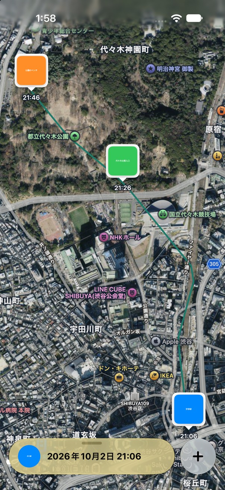
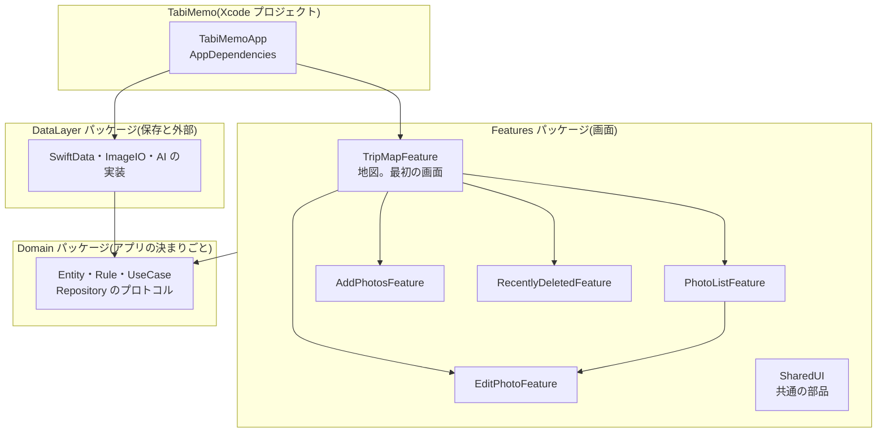
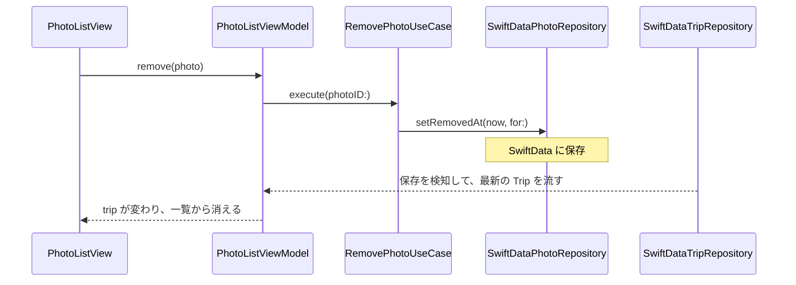

# 旅メモ

旅の写真を地図にピンで置いて、メモと一緒に残す iOS アプリです。

- 読み手: このリポジトリを初めて触る人・エージェント
- 目的: アプリの全体像と、コードのどこに何があるかを15分でつかめるようにする。細かい決まりは [docs/](docs/README.md) にあります



## いまできること

起動すると、トリップの地図が全画面で開きます(当面は地図画面だけに絞っています。[ADR 0001](docs/adr/0001-map-screen-only.md))。

| できること | 画面の仕様 |
|---|---|
| 軌跡と、写真を撮った順のつながりを地図に描く。開いたときは最初の写真が選ばれている。写真のピンを押すと、下のパネルに写真とメモが出る | [map-screen.md](docs/specs/map-screen.md) |
| パネルを3段階(コンパクト・ハーフ・全開)で開く。全開では左右のスワイプで前後の写真へ移る | [map-screen.md](docs/specs/map-screen.md) |
| 写真をまとめて追加する。撮影場所は写真の位置情報から入り、AI がタイトルとメモの案を出す | [add-photos.md](docs/specs/add-photos.md) |
| 地図を長押しして、その場所に写真を追加する。写真を撮った順の青い線は、道に沿って引かれる | [map-screen.md](docs/specs/map-screen.md) |
| 「…」の「経路を編集」で、青い線を長押ししてドラッグし、通る道を直す(何か所でも。1つ戻す・すべて戻すもある。保存される) | [map-screen.md](docs/specs/map-screen.md) |
| 右上の ▶ で、青い線に沿って目印が動き、地図が追いかける(写真の場所で止まる) | [map-screen.md](docs/specs/map-screen.md) |
| 写真の一覧で、並べ替え・取り除きをする | [photo-list.md](docs/specs/photo-list.md) |
| 取り除いた写真は7日間「最近取り除いた項目」に残り、元に戻せる | [recently-deleted.md](docs/specs/recently-deleted.md) |

データは端末の中だけに保存します(SwiftData。同期はしません)。リプレイなど、これから作るものは [ROADMAP.md](ROADMAP.md) にあります。

## 動かしてみる

必要なもの: Xcode 27 以降(プロジェクトが JSON 形式のため。確認は Xcode 27.2 beta)、iOS 27 のシミュレーター。

```bash
make xcode-open
```

Xcode が開いたら、左上のスキームを **TabiMemo** にして ⌘R で起動します。初回はデモのトリップ(渋谷→代々木公園、写真3枚)が入ります。

テストは、ターミナルからまとめて動かします。

```bash
scripts/test.sh
```

ビルドやシミュレーターでの確認の細かい手順は [development.md](docs/handbook/development.md) にあります。

## 全体像

コードは、3つの Swift Package と、殻だけのアプリに分かれています。矢印は「import してよい向き」です。逆向きに import するとビルドが失敗するので、境界を破ることはできません。



- **Domain** には、アプリの決まりごとだけを置きます。SwiftUI も SwiftData も知りません。だからテストが速く、どこからでも使えます。
- **DataLayer** は、Domain のプロトコルを SwiftData などで実装します。保存の仕方を変えても、画面は変わりません。
- **Features** は画面です。画面ごとにモジュールが分かれていて、他の画面を使ってよいかは `Features/Package.swift` で決まります。
- **TabiMemo**(アプリ)は、起動して部品を組み立てるだけです。組み立てるのは `AppDependencies` の1か所です。

なぜこう分けたかは [ADR 0009](docs/adr/0009-clean-architecture.md)(層)と [ADR 0013](docs/adr/0013-swift-packages.md)(パッケージ)にあります。

## 1つの操作の流れ

「写真の一覧で、写真を取り除く」を例に、コードを追います。



ポイントは2つです。

1. **View は ViewModel を呼ぶだけ、ViewModel は UseCase を呼ぶだけ。** 保存の方法は UseCase の先の Repository しか知りません。
2. **保存した後に読み直すコードはありません。** 画面は `start()` で Trip のストリームを受け取り続けていて、保存すると Repository が新しい値を流します。

## フォルダの地図

```text
tabi-memo/
├── TabiMemo/Sources/          アプリ。TabiMemoApp(起動)と AppDependencies(組み立て)
├── TabiMemo.xcodeproj/        JSON 形式のプロジェクト(project.xcproj)。ターゲットは TabiMemo だけ
├── Domain/
│   ├── Sources/Domain/
│   │   ├── Entities/          Trip・Photo などのデータ(純粋な struct)
│   │   ├── Rules/             並び順・クラスタ・保持期間などの計算
│   │   ├── Repositories/      保存のプロトコル
│   │   ├── Services/          写真の読み取り・AI のプロトコル
│   │   └── UseCases/          操作1つにつき1つの型(RemovePhotoUseCase など)
│   ├── Sources/TestSupport/   テスト用の偽物の Repository
│   └── Tests/
├── DataLayer/Sources/DataLayer/
│   ├── Records/               SwiftData の @Model(〜Record)と Entity への変換
│   ├── Repositories/          Repository の実装
│   ├── Services/              ImageIO・FoundationModels の実装
│   └── Persistence/           保存先とデモデータ
├── Features/Sources/
│   ├── TripMapFeature/        地図の画面と、下のパネル(Components/CustomSheet)
│   ├── PhotoListFeature/      写真の一覧
│   ├── AddPhotosFeature/      写真の追加
│   ├── EditPhotoFeature/      写真の編集
│   ├── RecentlyDeletedFeature/ 最近取り除いた項目
│   └── SharedUI/              複数の画面で使う部品
├── scripts/                   test.sh(テスト)、testflight.sh(配信)
└── docs/                      ADR・handbook・画面の仕様
```

新しいファイルは、該当するフォルダに置くだけでビルドに入ります。プロジェクトファイルや `Package.swift` を書き換えるのは、モジュールを足すときだけです。

## 用語

| 言葉 | 意味 | 例 |
|---|---|---|
| Entity | アプリが扱うデータ。純粋な struct | `Trip`、`Photo` |
| Rule | Entity を使った計算。保存や画面には触らない | `PhotoClustering` |
| UseCase | ユーザーの操作1つ。`execute` を1つだけ持つ | `RemovePhotoUseCase` |
| Repository | 保存と読み込みの窓口。Domain にプロトコル、DataLayer に実装 | `PhotoRepository` / `SwiftDataPhotoRepository` |
| Record | SwiftData に保存する型。DataLayer の外には出ない | `PhotoRecord` |
| ViewModel | 画面の状態と操作。`@Observable` のクラス | `PhotoListViewModel` |
| AppDependencies | 部品を組み立てる場所(Composition Root)。アプリに1つだけ | |
| TestSupport | テストで Repository の代わりに使う手書きの偽物 | `FakePhotoRepository` |

## よくある作業

| したいこと | 見るところ |
|---|---|
| 画面を1つ足す | [architecture.md「画面を1つ足す」](docs/handbook/architecture.md#手順-画面を1つ足す) |
| 操作(UseCase)を1つ足す | [architecture.md「UseCase を1つ足す」](docs/handbook/architecture.md#手順-usecase-を1つ足す) |
| 下のパネルを触る | [custom-sheet.md](docs/handbook/custom-sheet.md) |
| シミュレーターで確認する・スクリーンショットを撮る | [development.md](docs/handbook/development.md) |
| TestFlight に配信する | [release.md](docs/handbook/release.md) |
| なぜこの作りなのかを知る | [ADR の一覧](docs/adr/README.md) |

コードを書くときの決まり(命名、1ファイルの行数の上限、してはいけないこと)は [architecture.md](docs/handbook/architecture.md) にまとめてあります。行数などの上限は SwiftLint がビルドのたびに検査します。

## 技術

SwiftUI、SwiftData、MapKit、PhotosUI、FoundationModels(端末内の AI)。Swift 6 の strict concurrency。対象は iOS 27 以降です(SwiftData の `ResultsObserver` を使うため。[ADR 0009](docs/adr/0009-clean-architecture.md))。外部ライブラリは SwiftLint だけです。
