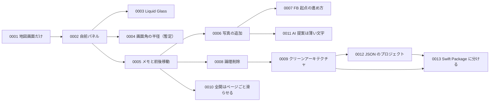

# ADR: Architecture Decision Records

- 読み手: 将来の自分・エージェントセッション
- 目的: 「なぜこの作りにしたか」を、コードから読み取れない範囲で残す

## いつ書くか

- ライブラリ・仕組みの採用/不採用を決めたとき
- 複数案を比較して構成を選んだとき
- 割り切り（既知の制約を承知で進める判断）をしたとき

見た目の微調整や、コードを読めば分かることは書かない。

## 書き方

- ファイル名: `NNNN-短いスラッグ.md`（連番4桁）
- 冒頭に状態を書く。構成: 決定 / 背景 / 比較 / 却下した案 / 見直しのタイミング / 参考
- 決定を覆すときは新しい番号で起票し、旧記録の状態を更新する

| 状態 | 意味 |
|---|---|
| 有効 | 現行の実装で採用している |
| 暫定 | 承知のうえで使っている。置き換え予定がある |
| 廃止 | 現行では採用していない。履歴用 |

## 一覧

| 番号 | 題 | 状態 |
|---|---|---|
| [0001](0001-map-screen-only.md) | 当面は地図画面だけに絞る | 有効 |
| [0002](0002-custom-bottom-panel.md) | システムのシートをやめ、自前の下部パネルにする | 有効 |
| [0003](0003-liquid-glass.md) | パネルと追加ボタンを Liquid Glass にする | 有効 |
| [0004](0004-private-corner-radius.md) | 画面角の半径に非公開キーを使う | 暫定 |
| [0005](0005-photo-memo-and-paging.md) | 写真のメモと、全開時の左右スワイプで前後へ移る | 有効(全開の動きは 0010 で変更) |
| [0006](0006-add-photos-flow.md) | 写真の追加は、複数選択 → 横にめくる詳細モーダル → 一括保存にする | 有効(提案の見せ方は 0011 で変更) |
| [0007](0007-feedback-driven-pdm.md) | FB 起点の進め方をスキルにして、要件確定までは実装しない | 有効 |
| [0008](0008-soft-delete-photos.md) | 写真の削除は、消さずに隠して7日後に完全に消す | 有効 |
| [0009](0009-clean-architecture.md) | クリーンアーキテクチャにし、層の境界をターゲットで守る | 有効 |
| [0010](0010-full-panel-page-slide.md) | 全開の左右スワイプは、写真と文字をページごと滑らせる | 有効 |
| [0011](0011-ai-suggestion-placeholder.md) | AI の提案は、入力欄の薄い文字と「適用」で見せる | 有効 |
| [0012](0012-xcode-json-project.md) | Tuist をやめ、Xcode の JSON 形式のプロジェクトをそのまま管理する | 有効 |
| [0013](0013-swift-packages.md) | 層と画面を Swift Package に分け、アプリのプロジェクトは殻だけにする | 有効 |

