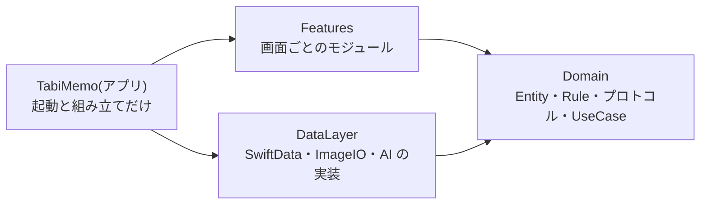
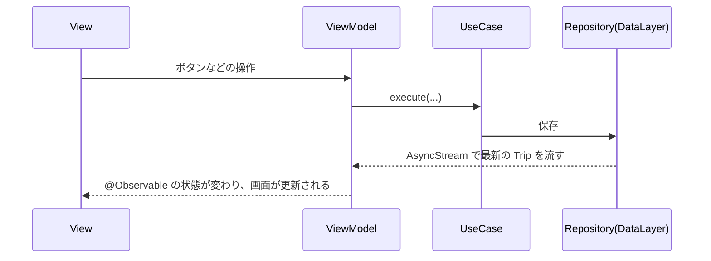

# コードの構成と書き方

- 読み手: このリポジトリでコードを書くエージェント(どのモデルでも)と、開発者本人
- 目的: どこに何を書くか・どう名付けるかを迷わず決められるようにする。新しい画面や操作は、下の「手順」をそのまま真似れば動く

決定の経緯は [ADR 0009](../adr/0009-clean-architecture.md)。

## 層と依存の向き



層は Swift Package で分けています([ADR 0013](../adr/0013-swift-packages.md))。依存は矢印の向きだけで、各パッケージの `Package.swift` に書いてあります。逆向きに import するとビルドが失敗します。

| 場所 | 置くもの | import してよいもの |
|---|---|---|
| `Domain/`(パッケージ) | `Sources/Domain/` Entity(純粋な struct)・Rule(純粋な計算)・Repository と Service のプロトコル・UseCase。`Sources/TestSupport/` テスト用の偽物 | Foundation だけ |
| `DataLayer/`(パッケージ) | `Sources/DataLayer/` `Records/` `@Model`(`〜Record`)と変換、`Repositories/` 実装、`Services/` 実装(ImageIO・AI・MapKit の経路検索)、`Persistence/` 保存先とデモデータ | Domain、SwiftData、ImageIO、FoundationModels、UIKit |
| `Features/`(パッケージ) | `Sources/<画面名>Feature/` 画面ごとの View と ViewModel。`Sources/SharedUI/` 複数の画面で使う部品 | Domain、SharedUI、依存する他の画面(下の表)、SwiftUI、MapKit、PhotosUI |
| `TabiMemo/`(Xcode プロジェクト) | `Sources/` 起動(`TabiMemoApp`)と組み立て(`AppDependencies`)、Assets。`Info.plist` | すべて |

画面のモジュールどうしの依存です。ここに無い依存を足すときは、`Features/Package.swift` の `dependencies` を直します。

| 画面のモジュール | 依存する画面 |
|---|---|
| `TripMapFeature`(地図。入口) | `PhotoListFeature` `AddPhotosFeature` `EditPhotoFeature` `RecentlyDeletedFeature` |
| `PhotoListFeature` | `EditPhotoFeature` |
| `AddPhotosFeature` `EditPhotoFeature` `RecentlyDeletedFeature` | なし |

新しいファイルは、該当モジュールの `Sources/` の中に置くだけです。パッケージのターゲットはフォルダごと読みます。モジュールを足すときだけ `Package.swift` を書き換えます([development.md](development.md))。

## データの流れ



- 読み込みは、ViewModel の `start()` で UseCase のストリームを `for await` で受け取ります。View は `.task { await viewModel.start() }` で呼びます。
- 保存した後に読み直すコードは書きません。DataLayer の `SwiftDataTripRepository` が、`ResultsObserver` と `Observations` を使って、保存のたびに最新の値を流し直します。
- 選択中の写真などは ID で持ち、表示する値はストリームの最新値から引きます。こうすると、編集後の値が自動で画面に出ます。

## 決まりごと

### 命名

| もの | 名前の形 | 例 |
|---|---|---|
| UseCase | 動詞 + 対象 + `UseCase`。メソッドは `execute` 1つ | `RemovePhotoUseCase` |
| Repository のプロトコル(Domain) | 対象 + `Repository` | `PhotoRepository` |
| Repository の実装(DataLayer) | 技術名 + プロトコル名 | `SwiftDataPhotoRepository` |
| Service のプロトコル(Domain) | 動名詞(`-ing`) | `PhotoSuggesting` |
| Service の実装(DataLayer) | 技術名 + 内容 | `FoundationModelsPhotoSuggester` |
| 保存の型(DataLayer) | Entity 名 + `Record` | `PhotoRecord` |
| 画面 | `XxxView` と `XxxViewModel` を、モジュール `XxxFeature` の `Sources/XxxFeature/` に置く | `Features/Sources/EditPhotoFeature/EditPhotoViewModel.swift` |

### 書き方

- 1ファイルに1つの型を置き、ファイル名を型名にします。拡張は `型名+内容.swift` にします。
- 別のモジュールから使う型・イニシャライザ・メソッドには `public` を付けます(`public init` は明示します。memberwise の init は `public` になりません)。付け忘れはビルドが教えてくれます。画面の中だけで使うものは `internal` のままにします。
- Domain のプロトコルと UseCase には `@MainActor` を付けます。Domain の既定のアクターは nonisolated、DataLayer と App は MainActor です。
- ViewModel は `@MainActor` の `@Observable final class` にします。UseCase をイニシャライザで受け取り、他の ViewModel や View を知らないようにします。
- View は、ViewModel の状態を描くことと、操作を ViewModel に渡すことだけをします。地図のカメラ位置のような、見た目だけの状態は View の `@State` に置きます。
- ViewModel は Domain の Entity と Rule を直接使ってかまいません(純粋な計算なので)。保存・読み込み・外部とのやり取りは、必ず UseCase を通します。
- 組み立ては `TabiMemo/Sources/AppDependencies.swift` の1か所だけで行います。外から呼ぶのは `live()` と `makeTripMapView()` だけで、他の `make〜` は `private` です。画面は `AppDependencies` を知りません。子画面を開く画面は、子画面の ViewModel を作る関数を、イニシャライザで受け取ります(`TripMapChildren` が実例)。
- コメントには「なぜ」を書きます。コードを読めば分かる「何を」は書きません。

### 数値の上限(SwiftLint で検査)

| 項目 | 警告 | エラー |
|---|---|---|
| ファイルの行数(コメントと空行を除く) | 200 | 300 |
| 型の本体の行数 | 150 | 250 |
| 関数の本体の行数 | 40 | 60 |
| 1行の文字数(コメントは除く) | 180 | 240 |

警告が出たら、分割してから終えます。設定は `.swiftlint.yml` にあります。変えるときは、この表も直します。

### してはいけないこと

| してはいけない | 代わりに |
|---|---|
| View や ViewModel で `import SwiftData`、`modelContext` を使う | UseCase を通す |
| Domain で `CLLocationCoordinate2D` などのフレームワークの型を使う | Domain の `Coordinate` を使う。App で `Coordinate+MapKit.swift` の変換を使う |
| 保存の後に読み直す | ストリームに任せる |
| 画面から、依存していない画面を import する | `Package.swift` の依存を見直す。関数を受け取る形にできないか考える |
| UseCase に `execute` 以外の public メソッドを足す | 別の UseCase を作る |
| `// swiftlint:disable` で上限を逃れる | ファイルや関数を分ける |

## 手順: UseCase を1つ足す

例として「写真のメモだけを書き換える」操作を足す場合です。

1. Repository に必要な操作が無ければ、`Domain/Sources/Domain/Repositories/` のプロトコルに足し、`DataLayer/Sources/DataLayer/Repositories/` の実装と `Domain/Sources/TestSupport/FakePhotoRepository.swift` にも足します。
2. `Domain/Sources/Domain/UseCases/UpdatePhotoMemoUseCase.swift` を作ります。

```swift
import Foundation

/// 写真のメモだけを書き換える。
@MainActor
public struct UpdatePhotoMemoUseCase {
    private let photoRepository: any PhotoRepository

    public init(photoRepository: any PhotoRepository) {
        self.photoRepository = photoRepository
    }

    public func execute(photoID: Photo.ID, memo: String) throws {
        // Domain のルールが要るなら、ここで Rules/ の関数を呼ぶ。
        try photoRepository.updateMemo(photoID, memo: memo)
    }
}
```

3. `Domain/Tests/DomainTests/` に、偽物の Repository(`FakePhotoRepository`)を使ったテストを書きます。
4. `TabiMemo/Sources/AppDependencies.swift` で、使う ViewModel に渡します。

## 手順: 画面を1つ足す

小さな実例は `Features/Sources/RecentlyDeletedFeature/` です(一覧の表示、元に戻す、完全に削除)。

1. `Features/Package.swift` の `products` に `.library(name: "XxxFeature", targets: ["XxxFeature"])`、`targets` に `feature("XxxFeature")` を足します。他の画面を開くなら `feature("XxxFeature", dependsOn: ["EditPhotoFeature"])` のように書きます。
2. `Features/Sources/XxxFeature/XxxViewModel.swift` を作ります。

```swift
import Domain
import Observation

@MainActor
@Observable
public final class XxxViewModel {
    private(set) var trip: Trip?

    private let tripID: Trip.ID
    private let observeTrip: ObserveTripUseCase
    private let removePhoto: RemovePhotoUseCase

    public init(tripID: Trip.ID, observeTrip: ObserveTripUseCase, removePhoto: RemovePhotoUseCase) {
        self.tripID = tripID
        self.observeTrip = observeTrip
        self.removePhoto = removePhoto
    }

    /// 画面が出ている間、トリップの最新の内容を受け取り続ける。
    func start() async {
        for await trip in observeTrip.execute(tripID: tripID) {
            self.trip = trip
        }
    }

    func remove(_ photo: Photo) {
        try? removePhoto.execute(photoID: photo.id)
    }
}
```

3. `XxxView.swift` を作ります。ViewModel はイニシャライザで受け取り、`@State` で持ちます。

```swift
import Domain
import SwiftUI

public struct XxxView: View {
    @State private var viewModel: XxxViewModel

    public init(viewModel: XxxViewModel) {
        _viewModel = State(initialValue: viewModel)
    }

    public var body: some View {
        List(viewModel.trip?.activePhotos ?? []) { photo in
            Text(photo.title)
        }
        .task { await viewModel.start() }
    }
}
```

4. `TabiMemo/Sources/AppDependencies.swift` に `makeXxxViewModel(...)` を足し、アプリの `import` に `XxxFeature` を足します。
5. 開く側の画面(例: `TripMapFeature`)に、`Package.swift` で `XxxFeature` への依存を足し、`TripMapChildren` に `makeXxx` の関数を足して、シートなどを出します。
6. `Features/Tests/FeaturesTests/` に、偽物の Repository で作った UseCase を渡して、ViewModel のテストを書きます。

## テスト

| パッケージ | ターゲット | 対象 | 使うもの |
|---|---|---|---|
| `Domain` | `DomainTests` | Rule と UseCase | `TestSupport` の偽物の Repository |
| `DataLayer` | `DataLayerTests` | Repository の実装、Record との変換、ImageIO | メモリ上の `SwiftDataStore.inMemory()` |
| `Features` | `FeaturesTests` | ViewModel | 偽物の Repository で作った本物の UseCase |

- テストは Swift Testing(`@Test`、`#expect`)で書きます。
- 偽物は `Domain/Sources/TestSupport/` に手書きします(`public`)。`DomainTests` と `FeaturesTests` が使います。
- まとめて動かすのは `scripts/test.sh`(1つでも失敗すると終了コードが 1 になります)。パッケージごとに動かすときは、そのフォルダで `xcodebuild test -scheme <スキーム名>` です([development.md](development.md))。
- 画面の見た目は、シミュレーターで確認します。手順は [development.md](development.md) にあります。
