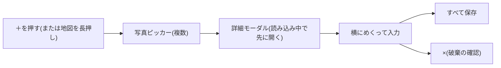

# 画面仕様: 写真の追加

- 読み手: 実装者・確認者(本人・エージェント)
- 目的: 追加ボタンから保存までの流れと、各ページの挙動を定義する
- 設計の理由: [ADR 0006](../adr/0006-add-photos-flow.md)
- 確認: iPhone 18 Pro(iOS 27)シミュレーター、2026-10-04。AI の提案は実機で未確認

## 1. 流れ

## 2. 詳細モーダル

| 項目 | 挙動 |
|---|---|
| 上部 | 左に×、中央にページの点(いまのページが濃い。横にめくれることも示す)、右に「並べ替えへ」(1枚のときは「保存」) |
| 写真 | 高さ280pt以内で全体を見せる。左右の端に薄い矢印(＜ ＞)を重ねる。前後のページがあるほうだけ出て、押すとそのページへ移る |
| 日時 | 写真のデータから入れる。無ければ現在時刻を入れ、注記を出す |
| 場所 | GPS があれば「写真の位置情報」。無ければ赤字の「未設定」で、タップすると地図でピンを置く。地図の長押しから来たときは、すべて長押しした位置で「地図で指定済み」になる |
| タイトル・メモ | 手入力。空のときは AI の案を薄い文字で出し、項目名の右の「適用」で入れられる([ADR 0011](../adr/0011-ai-suggestion-placeholder.md)) |
| 保存 | 全ページの位置が決まるまで押せない |
| 読み込み失敗 | 「この写真を外す」で除く |

位置を指定する地図は、前後する写真(この流れで確定済みのものも含む)の中間点に先に動く。1枚もなければ、いまの地図の中心。

## 3. AI の提案

端末内モデル(画像入力に対応しているとき)→ PCC の順に試す。使えない・利用枠切れ・通信なしのときは、薄い文字はふつうの「タイトル」「メモを書く」のままで、「適用」も出ない。作っている間は「AI がタイトルを考えています…」と出す。提案は表示中とその次のページだけ先に作る。

保存すると、地図にある写真が全部収まるよう地図が動く(FB-5)。

## 4. テスト

メタデータの読み取りは `ImageIOPhotoMetadataReaderTests`(DataLayer)、位置の初期値は `PhotoLocationGuessTests`(Domain)、並べ替えと保存は `AddPhotosViewModelTests` で確認している。

## 5. 次へと並べ替え(2026-10-04 追加)

- 複数枚のとき、各ページの右上は最後のページでも「並べ替えへ」(「次へ」だと次の写真へ進むと読めるため)。1枚のときは「保存」。数字の「1/3」もやめ、点で表す。全ページの読み込みと位置が済むまで押せない。
- 「並べ替えへ」で並べ替え画面に入る。**地図にすでにある写真も全部含む**(追加分には「追加」の印)。最初の並びは日時の順。行を長押しして動かす。各行の日時は、いまの日時を古い順に並べ直して並びの順に割り当てた値で、動かすと表示も変わる。
- 保存すると、すでにある写真の日時も、並びに合わせて割り当て直される。
- 並べ替え画面の「すべて保存」で保存する。戻るボタンで入力ページに戻れる。
