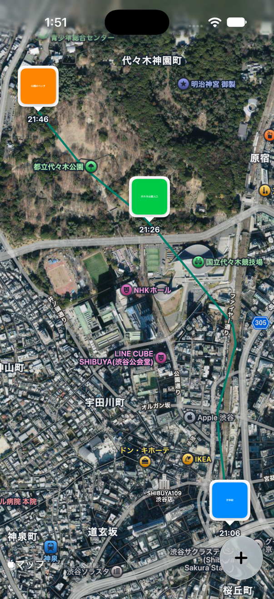
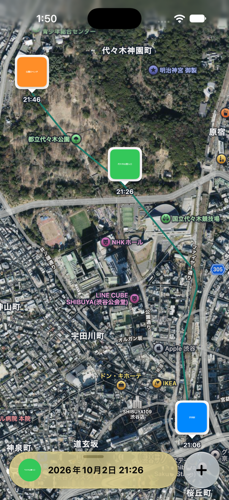
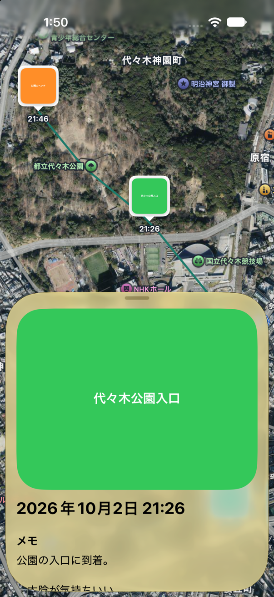
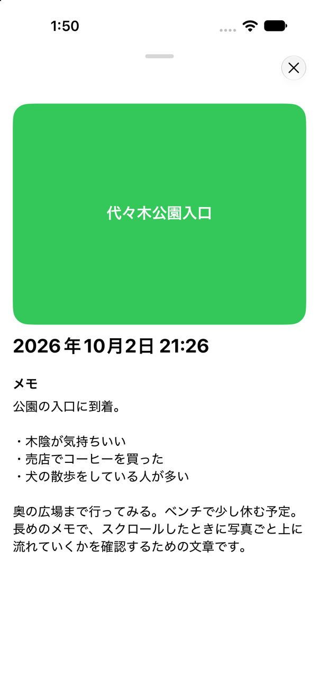
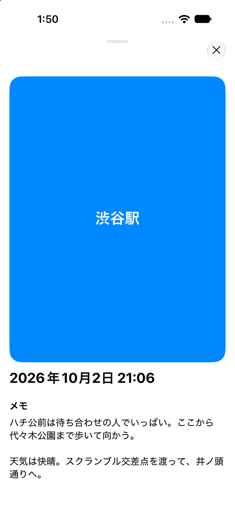
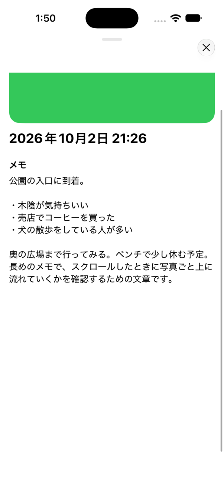
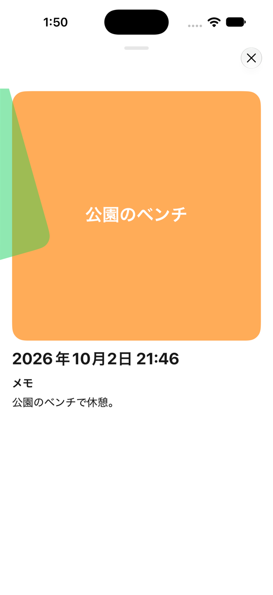

# 画面仕様: 地図画面（トリップ詳細）

- 読み手: 実装者・確認者（本人・エージェント）
- 目的: 地図画面とその下部パネルの挙動を、スクリーンショットつきで定義する
- 対象: [TripMapFeature/](https://github.com/akidon0000/tabi-memo/blob/5968d9876c08f7a80e10770d6731385d44480256/Features/Sources/TripMapFeature) / [Components/CustomSheet/](https://github.com/akidon0000/tabi-memo/blob/5968d9876c08f7a80e10770d6731385d44480256/Features/Sources/TripMapFeature/Components/CustomSheet)(`Features` パッケージ)
- 撮影: iPhone 18 Pro（iOS 26）シミュレーター、デモデータ（渋谷→代々木公園、写真3枚）。撮影日 2026-10-03
- 設計の理由: [ADR](../adr/README.md)

## 1. 画面の構成

アプリを起動すると、軌跡のあるトリップの地図が全画面で開く（ナビゲーションバーは出さない）。撮影順で最初の写真が選ばれていて、下のパネルがコンパクトで出ており、地図もそのピンへ動く（起動のたびに1回だけ。[要件 0003](../requirements/0003-route-first-pin-long-press.md)）。

| 要素 | 内容 |
|---|---|
| 地図 | ハイブリッド（衛星写真＋地名）。軌跡を青い線で、写真を撮った順のつながりを白い破線で描く。破線は道に沿う（求められない区間は直線。[ADR 0014](../adr/0014-route-along-roads.md)）。何もない場所を長押しすると、そこに写真を追加できる |
| 写真ピン | 吹き出し型のサムネイル（52pt）と撮影時刻。タップでパネルを開く。重なるときは1つのピンにまとめる（後述） |
| 「…」メニュー | 右上の円形ガラスのボタン。写真の一覧([photo-list.md](photo-list.md))、最近取り除いた項目([recently-deleted.md](recently-deleted.md)) |
| 追加ボタン | 右下の円形ガラスのボタン（64pt）。写真の追加([add-photos.md](add-photos.md))。保存すると、写真が全部収まるよう地図が動く |
| 下部パネル | 写真ピンをタップすると出る。3段階（後述） |

## 2. 下部パネルの3段階

| 段階 | 高さ | 見た目 | 追加ボタン | × |
|---|---|---|---|---|
| コンパクト | 64pt | カプセル型のバナー（サムネイル 40pt＋日時）。ガラス＋黄の tint | バナーの右に別の円で並ぶ | なし |
| ハーフ | 写真＋日時がちょうど収まる高さ（写真の縦横比で変わる。メモなどの中身は出さない） | 大きな写真＋日時。背景は透明で地図がガラス越しに透ける。角丸は端末の画面角に同心 | 消える | なし |
| 全開 | 上のセーフエリアの下まで | 白い背景。余白・角丸なし。写真・日時・メモは一緒にスクロール | なし | 右上に出る |

### 切り替え

| 操作 | 結果 |
|---|---|
| ピンをタップ | コンパクトで開く（別のピンなら、閉じずに中身だけ入れ替わる） |
| バーをタップ | コンパクト→ハーフ→全開。全開では何も起きない |
| バーやヘッダーをドラッグ | 離したときの勢いを含めて、一番近い段階に吸着する |
| 全開で上部のバーを下に引く | ハーフ→コンパクトへ畳む |
| 全開で中身がいちばん上のとき、さらに下へ 70pt 以上引く | コンパクトへ畳む（FB-8） |
| ∨ を押す（全開のみ） | コンパクトに戻る |

- パネルを完全に閉じる操作はない。コンパクトが最小。
- 全開になって4秒後から、4秒ごとにバーが下へ小さく揺れ、「下にスワイプで畳める」ことを知らせる。指が触れている間は揺らさない。

## 3. 写真の見せ方

| 段階 | 写真 |
|---|---|
| コンパクト | 40pt の角丸サムネイル（パネルの角に同心） |
| ハーフ | 幅いっぱい。高さは写真の縦横比どおり（最小 240pt）。上限は画面高さの約42% |
| 全開 | 同上。上限は画面高さの約6割。スクロールすると上へ流れる |

縦長の写真は、全開でそのまま縦長に出る。

## 4. 全開でのスクロール

写真・日時・メモが一緒に上へ流れる。バーと × は上に浮かぶだけで、専用の背景帯は敷かない（全開はパネル全体が同じ白で、色が途中で切り替わらない）。

## 5. 写真の拡大表示

ハーフ・全開で写真をタップすると、下からせり上げず、後ろから薄く・小さい状態からふわっと現れて、黒背景の全画面で写真を拡大表示する（コンパクトのサムネイルでは出ない）。

| 操作 | 結果 |
|---|---|
| ピンチ | 拡大・縮小（1倍より小さくはならない） |
| ダブルタップ | 2.5倍と元の大きさを切り替える |
| 拡大中にドラッグ | 写真を動かす |
| 等倍で下にスワイプ（80pt 以上、または勢いよく払う）／× | 閉じる。黒い余白のどこを引いてもよい。引くほど写真は小さく、背景は薄くなる |

## 6. 写真のメモ

- 写真の日時の下に、タイトルとメモを出す。読むだけで、書き換えは写真の右下のペンから([ADR 0008](../adr/0008-soft-delete-photos.md))。
- 内容は `Photo.title` / `Photo.memo` に保存される。

## 7. 左右スワイプで前後の写真へ（ハーフ・全開）

- 撮影順で前後の写真に移る。端の写真ではそれ以上進まない（少し抵抗して戻る）。
- 110pt 以上動かすか、勢いよく払うと、次の写真に替わる。足りなければ戻る。写真は薄くしない（FB-9）。
- **ハーフ**: 指に追従して写真だけが横へ動き、傾き、飛んでいく。日時は動かず、スワイプ量に応じて薄くなって入れ替わる。向かう先の写真が後ろに先に見えている。
- **全開**: 写真・日時・メモを1枚のページとして一緒に横へ滑らせる。隣のページは横から入ってくる（[ADR 0010](../adr/0010-full-panel-page-slide.md)、FB-7）。

- スワイプで写真が替わると、地図がそのスポットへ動く（拡大率は変えず、画面の上から1/4の高さに来る）。
- コンパクトでは、左右にドラッグしても写真は移らない。

## 8. 重なったピンのまとめ（FB-3）

- いまの縮尺で、ピン1つぶん（幅60pt・高さ67pt）より近い写真を1つのピンにまとめる。撮影の早い写真のピンの位置に立てる。
- 大きさは1枚のピンと同じ。2枚は左右に半分ずつ、3枚は左1枚・右2枚、4枚以上は 2×2。5枚以上は4マス目に「+残り枚数」。ピンの下に「N枚」。
- 押すと地図を寄せて分かれて見えるようにする。20m 以内に重なっていて寄せても分かれないときは、最初の写真を開く。

## 9. 写真を追加した後の地図（FB-5）

- 保存したら、地図にある写真がすべて収まる範囲へ動く。下の追加ボタン・パネルに隠れないよう、下側の余白を広く取る。
- 1枚だけのときは、幅約600m まで寄せる。
- 地球の半分を超えて散らばった写真は収まらない（最大まで引いた状態になる）。日付変更線をまたぐ範囲も、太平洋側では囲まない。

## 10. 長押しで写真を追加する

- 地図の何もない場所を0.5秒長押しすると、写真ピッカーが開く。選んだ写真は、すべて長押しした位置に置く（写真の位置情報より優先）。「位置は手動で指定されました」と出る。位置は、追加画面の「場所」で直せる。
- 右下の「+」から追加するときは、いままでどおり写真の位置情報から位置を決める。

## 11. 既知の未対応・未確認

| 項目 | 状況 |
|---|---|
| 画面角の半径 | 非公開キーを使用。[ADR 0004](../adr/0004-private-corner-radius.md)。審査前に置き換える |
| 拡大表示の細部 | ピンチ・ダブルタップ・拡大中のドラッグは、実機での操作感を未確認（表示と × は確認済み） |
| メモ編集中のキーボード | 入力欄が隠れないかは未確認 |
| スワイプの途中の見た目 | 動き・傾きは、静止画では確認しきれていない（06 は ADR 0010 より前の、写真だけ動く版の途中のフレーム） |
| 引き上げ中のタイトル | 途中の瞬間に、タイトルが写真と重なって見えることがある |
| 他機種 | iPhone 18 Pro 以外（角の小さい機種など）は未確認 |
| 道なりの線 | 実機での取得の速さ・圏外のときの見え方は未確認。電車・飛行機の区間は直線のまま |
| 長押し | ピンの上や、パネルが出ている範囲での長押しの挙動は未確認 |
